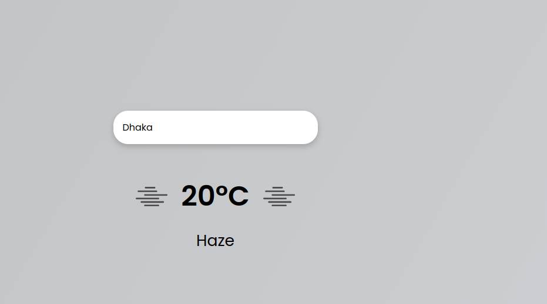

## About Weather App

Simple Weather app by using Vanilla JS

## Visit Link

We would like to extend our thanks to the following sponsors for funding development.
If you are interested in becoming a sponsor, please visit the https://dip-weather.netlify.app/

## Contributing

Thank you for considering contributing to Weather App

## Security Vulnerabilities

If you discover a security vulnerability, please send an e-mail to Dip Ghosh via(mailto:dipghosh638@gmail.com). All security vulnerabilities will be promptly addressed.

## License

This is open-sourced software licensed under the [MIT license](https://opensource.org/licenses/MIT).
